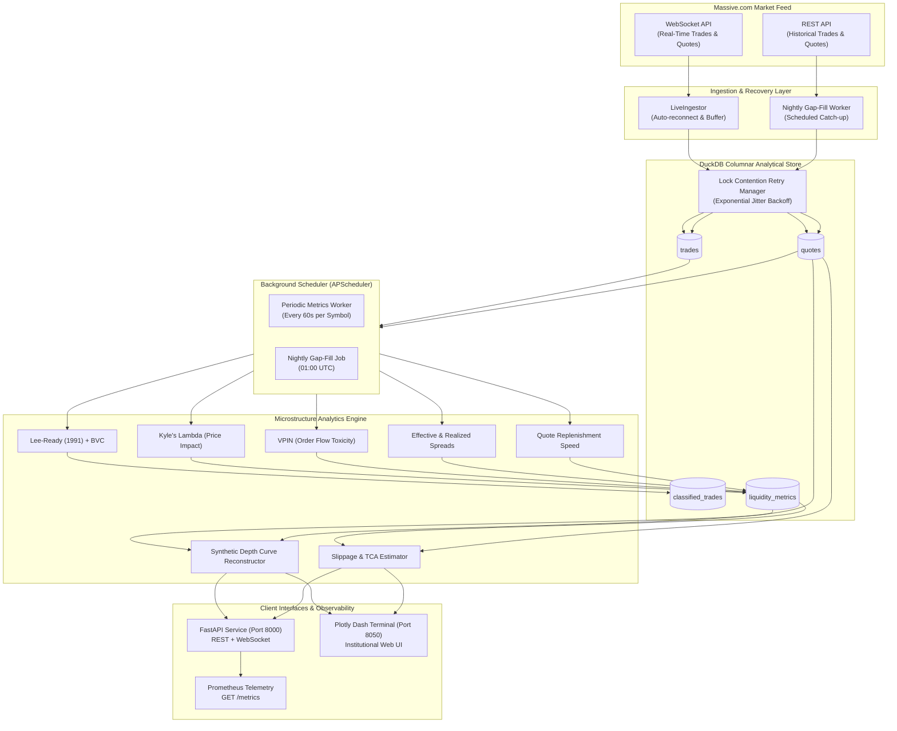

# Synthetic Depth Engine

**Synthetic Depth Engine** is a high-performance market-liquidity and microstructure analytics platform built on top of the **Massive.com** (formerly Polygon.io) stock market data API.

---

## 🎯 Purpose & Core Concept

Direct Level 2 and Level 3 full order-book feeds (such as NASDAQ TotalView or NYSE OpenBook) are cost-prohibitive for many institutional research workflows and quantitative models. 

**Synthetic Depth Engine** reconstructs synthetic market depth and computes advanced liquidity/microstructure metrics by fusing tick-level trade executions with NBBO (National Best Bid and Offer) top-of-book quote streams:

- **Trade Direction Classification**: Implementing the **Lee-Ready (1991)** algorithm with reporting lag adjustment ($\tau$) and tick rule fallback, alongside **Bulk Volume Classification (BVC)**.
- **Kyle's Lambda (Price Impact Coefficient)**: Linear regression of price changes against signed order flow ($\text{OFI}_t = V_{buy, t} - V_{sell, t}$) over rolling windows.
- **Amihud Illiquidity Ratio**: $|Return_t| / \text{DollarVolume}_t$ measuring price response per dollar of trading volume.
- **Quote Replenishment Speed**: Tracking NBBO depth replenishment times around large trade prints.
- **Microstructure Spreads**: Computing Effective Spread and 5-minute Realized Spread (adverse selection component).
- **VPIN (Volume-Synchronized Probability of Informed Trading)**: Estimating continuous order flow toxicity.
- **Synthetic Depth Reconstruction (`SyntheticDepthEstimator`)**: Inverting Kyle's lambda and weighting replenishment dynamics to model multi-level depth curves away from NBBO.
- **Slippage Estimation (`SlippageEstimator`)**: Simulating order execution costs, basis points slippage, and confidence levels.
- **Background Metrics Worker & Nightly Gap Filler**: Dedicated scheduler computing metrics periodically and backfilling missed ticks from stream disconnects.
- **Production FastAPI Service & Prometheus Telemetry**: High-speed REST & WebSocket API with API key authentication, in-memory sliding-window rate limiting, `/metrics` endpoint, and auto-generated OpenAPI documentation.
- **Interactive Institutional Dashboard (Plotly Dash)**: Real-time visual terminal for depth exploration, time-series analysis, TCA slippage calculation, and multi-symbol watchlist monitoring.
- **Columnar Analytical Storage**: Backed by **DuckDB** with automatic lock contention retry resilience.

---

## 🏛 System Architecture



---

## 🏗 Architecture & Package Structure

```
synthetic-depth-engine/
├── .env.example                     # Environment template (API key, DuckDB path)
├── .dockerignore                    # Docker build exclusion rules
├── Dockerfile                       # Multi-stage container build
├── docker-compose.yml               # Multi-container orchestration (api, dashboard, worker)
├── DEPLOYMENT.md                    # Complete production deployment & scaling guide
├── pyproject.toml                   # Poetry project configuration & dependencies
├── README.md                        # Project documentation
├── docs/
│   ├── massive-api-notes.md         # Exhaustive data contracts for Massive REST & WebSocket
│   └── model-validation.md          # Empirical proxy backtesting report & model boundaries
├── scripts/
│   ├── smoke_test.py                # Massive API connectivity verification script
│   └── validate_synthetic_depth.py  # Statistical validation runner on DuckDB data
├── src/
│   └── synthetic_depth/
│       ├── __init__.py              # Package entry point
│       ├── config.py                # Pydantic Settings (.env loader)
│       ├── logging_config.py        # Centralized structured logger
│       ├── worker/                  # Background worker daemon
│       │   ├── __init__.py
│       │   └── worker.py            # BackgroundMetricsWorker & NightlyGapFillWorker
│       ├── dashboard/               # Plotly Dash Institutional Terminal
│       │   ├── __init__.py
│       │   ├── app.py               # Dash app runner
│       │   ├── layout.py            # Dark institutional terminal layout
│       │   ├── callbacks.py         # Reactive callbacks (depth, time-series, slippage)
│       │   ├── components.py        # Plotly chart factories & watchlist tables
│       │   └── assets/
│       │       └── terminal.css     # Dark terminal styles & CSS variables
│       ├── api/                     # FastAPI Service Layer
│       │   ├── __init__.py          # App instance export
│       │   ├── app.py               # App factory, middleware & Prometheus router
│       │   ├── observability.py     # Prometheus telemetry & latency middleware
│       │   ├── schemas.py           # Pydantic v2 schemas with structural disclaimers
│       │   ├── security.py          # Header-based API key auth & rate limiting
│       │   └── routes/
│       │       ├── __init__.py
│       │       ├── health.py        # GET /health
│       │       ├── liquidity.py     # GET /symbols/{symbol}/liquidity-score, /metrics/history
│       │       ├── synthetic_depth.py # GET /symbols/{symbol}/synthetic-depth
│       │       ├── slippage.py      # POST /symbols/{symbol}/slippage-estimate
│       │       └── websocket.py     # WS /ws/symbols/{symbol}/live-liquidity
│       ├── ingestion/               # Massive.com REST & WebSocket client wrappers
│       │   ├── __init__.py
│       │   ├── cli.py               # Unified CLI (backfill, live, classify, metrics, depth, slippage, dashboard, worker)
│       │   ├── historical.py        # HistoricalIngestor with pagination & resume
│       │   ├── live.py              # LiveIngestor with WebSocket streaming & auto-reconnect
│       │   ├── rest_client.py       # REST client with 429 exponential backoff
│       │   └── websocket_client.py  # WebSocket client wrapper
│       ├── storage/                 # DuckDB persistent storage layer
│       │   ├── __init__.py
│       │   ├── schema.py            # DDL schemas for trades, quotes, classified_trades, liquidity_metrics, ingestion_log
│       │   └── duckdb_layer.py      # DuckDB connection & lock retry manager
│       └── microstructure/          # Microstructure & liquidity analytics
│           ├── __init__.py
│           ├── classification.py    # Lee-Ready & BVC classification engine
│           ├── metrics.py           # Kyle Lambda, Amihud, Replenishment, Spreads, VPIN, LiquidityScore
│           └── synthetic_book.py    # Synthetic Depth & Execution Slippage Estimator
└── tests/                           # Pytest test suite (57 tests)
    ├── __init__.py
    ├── test_worker.py               # Background metrics worker & gap-fill tests
    ├── test_observability.py        # Prometheus /metrics & latency middleware tests
    ├── test_dashboard.py            # Plotly Dash chart, component, and layout tests
    ├── test_api.py                  # FastAPI endpoint, auth, and rate limit integration tests
    ├── test_classification.py       # Hand-crafted edge cases for Lee-Ready & BVC
    ├── test_metrics.py              # Microstructure liquidity metric tests
    ├── test_synthetic_book.py       # Depth curve reconstruction & slippage walking tests
    ├── test_cli.py                  # CLI argument parsing & dispatching
    ├── test_config.py               # Settings validation & placeholder checks
    ├── test_historical_ingestor.py  # Pagination, idempotency, rate limit backoff
    ├── test_live_ingestor.py        # WebSocket buffering & batch flushing
    ├── test_rest_client.py          # Dual SDK/httpx fallback & HTTP 429 retry
    ├── test_smoke.py                # Smoke test execution & mocking
    └── test_storage.py              # DuckDB table creation & batch insertions
```

---

## 🚀 Quickstart

### 1. Docker Compose (Production Setup)
```bash
# Build and run all services in the background
docker compose up -d --build

# Verify health status
curl http://localhost:8000/health
```

### 2. Launch Local Development Services
```bash
# Start background worker daemon (every 60s per symbol)
poetry run python -m synthetic_depth.ingestion.cli worker --symbols AAPL,MSFT --interval 60

# Start FastAPI service (port 8000)
poetry run uvicorn synthetic_depth.api.app:app --port 8000 --reload

# Start Plotly Dash dashboard (port 8050)
poetry run python -m synthetic_depth.ingestion.cli dashboard --port 8050
```

---

## 🧪 Running Automated Tests & Validation

```bash
# Run all 57 unit, integration, and worker tests
poetry run pytest -v

# Run proxy backtesting validation runner
poetry run python scripts/validate_synthetic_depth.py
```
Detailed model validation benchmarks and boundary analysis are documented in [docs/model-validation.md](docs/model-validation.md) and deployment instructions in [DEPLOYMENT.md](DEPLOYMENT.md).
